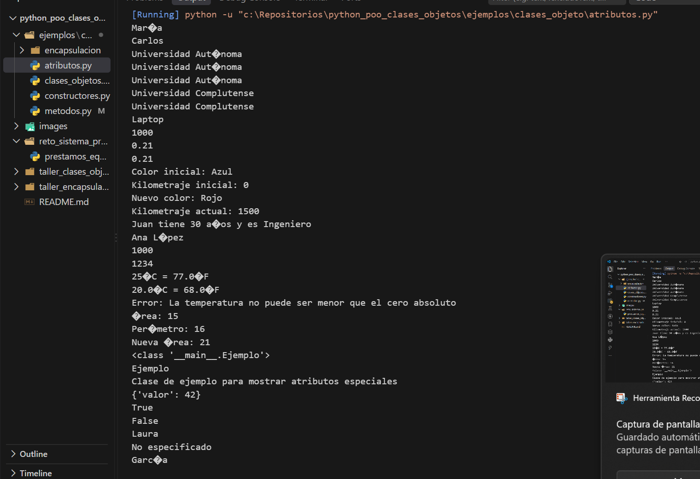
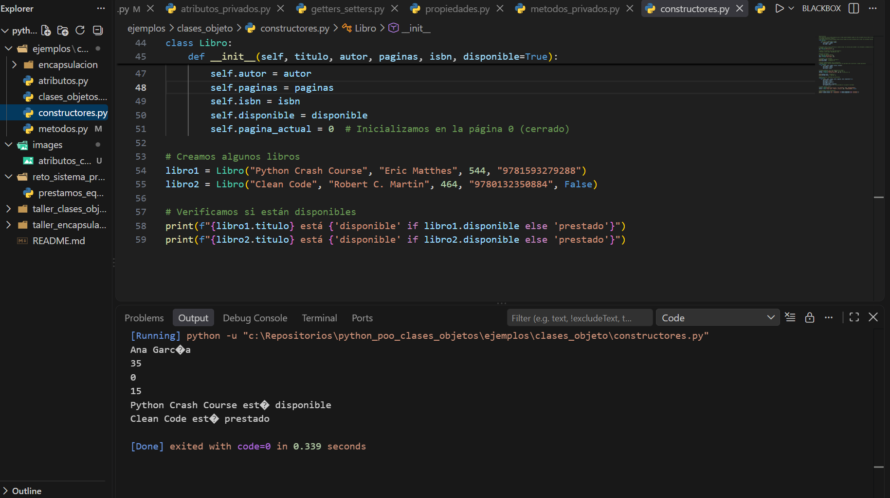
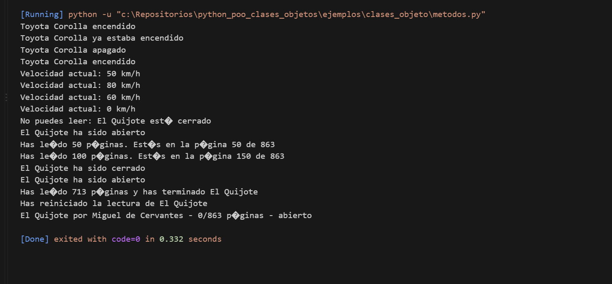
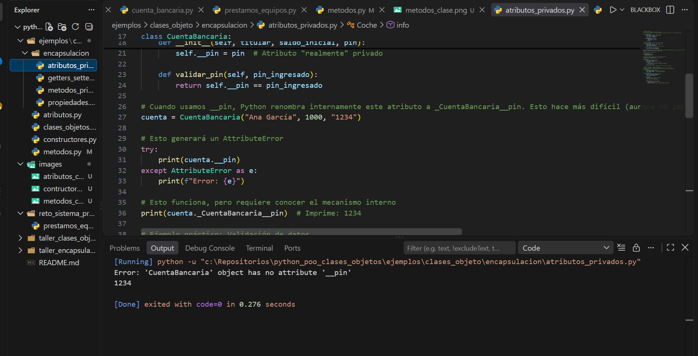
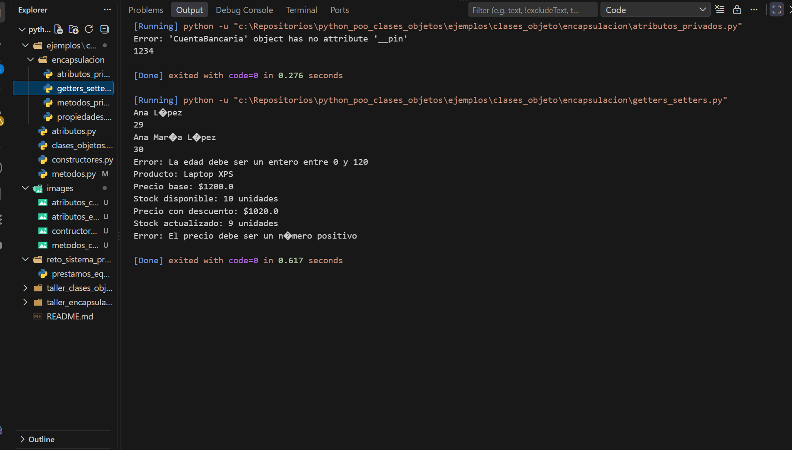
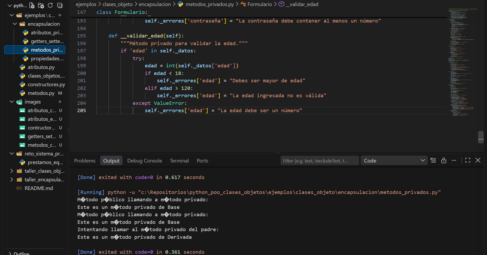
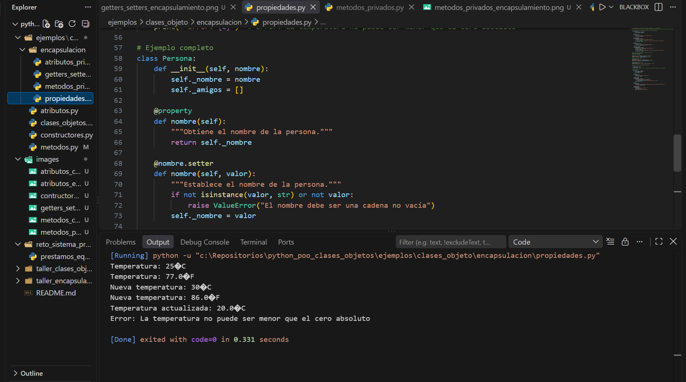

# Fundamentos de Python: Clases, Objetos y Encapsulación

## Descripción del proyecto

Este repositorio contiene el desarrollo de la actividad **GA1-220501093-04-AA1-EV04 – Fundamentos de Python: Clases, Objetos y Encapsulación**.

El proyecto tiene como objetivo aplicar los fundamentos de la Programación Orientada a Objetos (POO) en Python mediante la replicación de ejemplos del material de formación, el desarrollo de ejercicios prácticos y la construcción de un proyecto integrador.

Durante el desarrollo de la actividad se trabajan conceptos como:

- Clases y objetos.
- Constructores.
- Atributos de instancia y de clase.
- Métodos.
- Métodos especiales.
- Métodos estáticos y de clase.
- Encapsulación.
- Atributos privados y protegidos.
- Propiedades (`@property`).
- Getters y setters.
- Validación y control de acceso a los datos.

El proyecto se encuentra organizado por ejemplos, talleres y un reto integrador, permitiendo aplicar progresivamente los conocimientos adquiridos.

---

## Estructura del proyecto

```text
python_poo_clases_objetos/
│
├── ejemplos/
│   └── clases_objeto/
│       ├── encapsulacion/
│       │   ├── atributos_privados.py
│       │   ├── getters_setters.py
│       │   ├── metodos_privados.py
│       │   └── propiedades.py
│       │
│       ├── atributos.py
│       ├── clases_objetos.py
│       ├── constructores.py
│       └── metodos.py
│
├── images/
│   ├── atributos_clases_objetos.png
│   ├── constructores.png
│   ├── metodos_clases_objetos.png
│   ├── atributos_privados_encapsulamiento.png
│   ├── getters_setters_encapsulamiento.png
│   ├── metodos_privados_encapsulamiento.png
│   └── propiedades_encapsulamiento.png
│
├── taller_clases_objetos/
│
├── taller_encapsulacion/
│
├── reto_sistema_prestamos/
│
└── README.md
```

## Temas aprendidos

## Clases y objetos

Las **clases** funcionan como plantillas que permiten definir los atributos y comportamientos que tendrán los objetos.

Los **objetos** son instancias concretas de una clase y poseen sus propios valores para los atributos definidos.

## Constructores

El método `__init__` permite inicializar los atributos de un objeto cuando este es creado.

También se trabajó con parámetros, valores predeterminados y validaciones dentro de los constructores.

## Atributos

Se trabajaron los atributos de instancia y los atributos de clase, además de diferentes formas de acceder, modificar y validar sus valores.

## Métodos

Los métodos son funciones definidas dentro de una clase que representan los comportamientos que pueden realizar sus objetos.

Se trabajaron métodos con parámetros, métodos que retornan valores, métodos que interactúan con atributos y métodos que llaman a otros métodos.

También se estudiaron métodos especiales, métodos estáticos y métodos de clase.

## Encapsulación

La encapsulación permite agrupar datos y comportamientos dentro de una clase y controlar la forma en que se accede y modifican determinados atributos.

Se trabajaron atributos públicos, protegidos y privados, además de mecanismos de control mediante propiedades.

## Propiedades, getters y setters

Se utilizaron `@property` y setters para controlar el acceso y modificación de atributos, permitiendo agregar validaciones antes de cambiar sus valores.

---

# Ejemplos replicados del material

En esta sección se encuentran los ejemplos desarrollados a partir del material de formación sobre clases, objetos y encapsulación.

Los ejemplos fueron implementados en archivos `.py` independientes y ejecutados en consola para comprobar su funcionamiento.

## Clases y objetos

Se replicaron ejemplos relacionados con:

- Definición de clases.
- Creación de objetos.
- Constructores.
- Atributos.
- Métodos.
- Métodos especiales.
- Métodos estáticos.
- Métodos de clase.

### Evidencia de ejecución

### atributos de las clase


### Constructores 



### Métodos



## Encapsulación

Se replicaron ejemplos relacionados con:

- Atributos públicos, protegidos y privados.
- Métodos privados.
- Getters y setters.
- Propiedades mediante `@property`.
- Validación y control de acceso a los atributos.

### Evidencia de ejecución

### Atributos privados



### Getters y Setters



### Métodos privados



### Propiedades



## Talleres

--- 
Proximamente....

