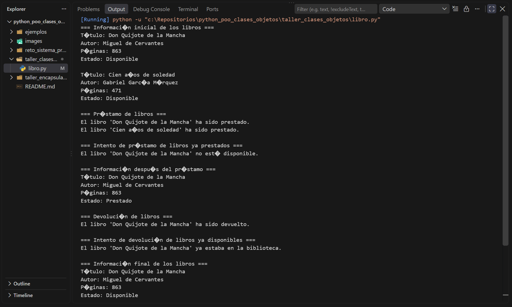
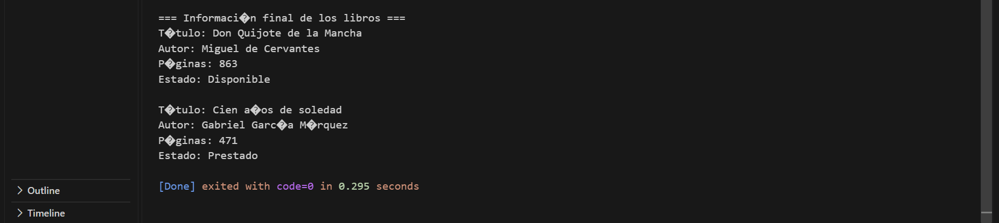
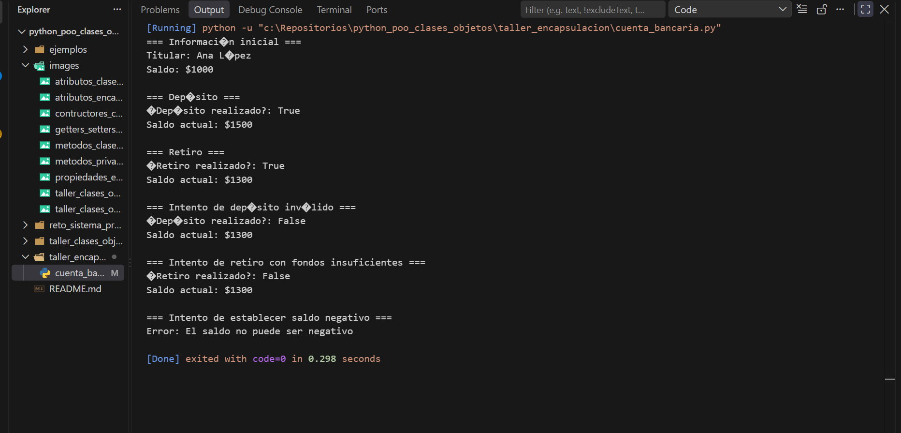
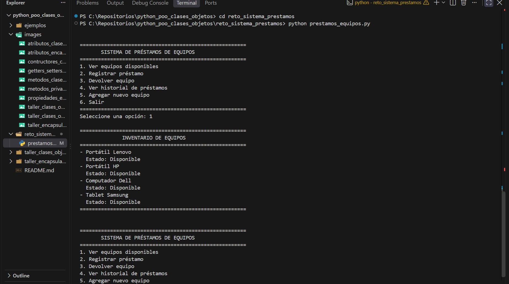
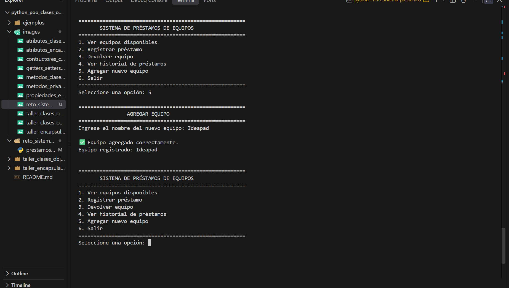
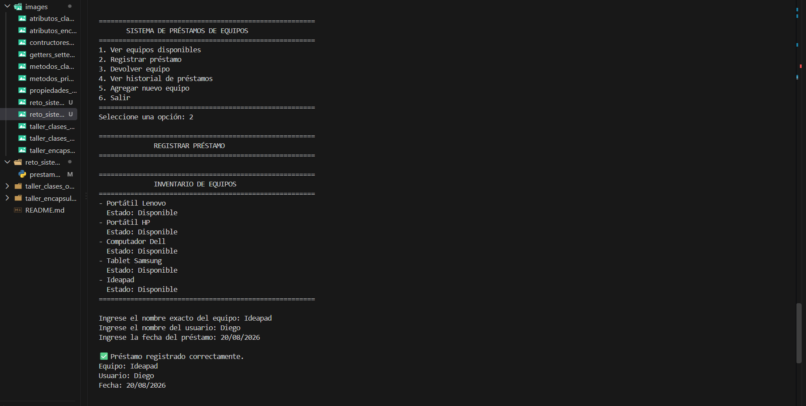
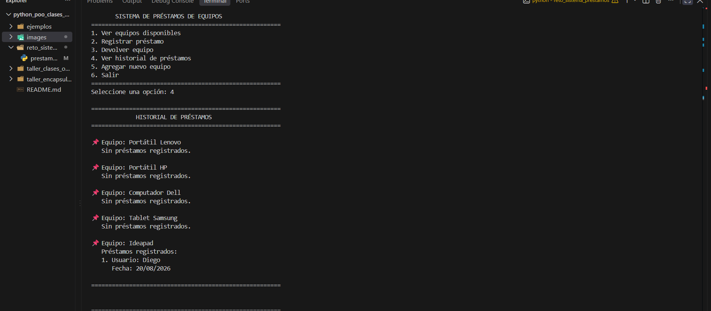
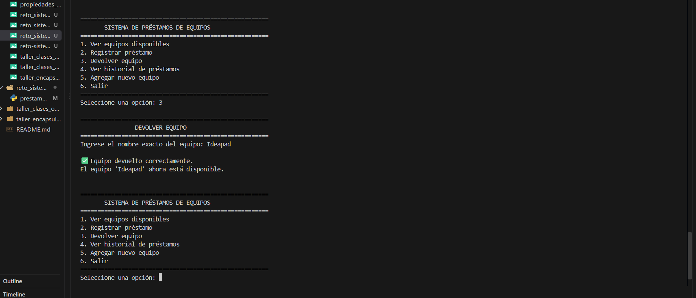

# Fundamentos de Python: Clases, Objetos y Encapsulación

## Descripción del proyecto

Este repositorio contiene el desarrollo de la actividad **GA1-220501093-04-AA1-EV04 – Fundamentos de Python: Clases, Objetos y Encapsulación**.

El proyecto tiene como objetivo aplicar los fundamentos de la Programación Orientada a Objetos (POO) en Python mediante la replicación de ejemplos del material de formación, el desarrollo de ejercicios prácticos y la construcción de un proyecto integrador.

Durante el desarrollo de la actividad se trabajan conceptos como:

- Clases y objetos.
- Constructores.
- Atributos de instancia y de clase.
- Métodos.
- Métodos especiales.
- Métodos estáticos y de clase.
- Encapsulación.
- Atributos privados y protegidos.
- Propiedades (`@property`).
- Getters y setters.
- Validación y control de acceso a los datos.

El proyecto se encuentra organizado por ejemplos, talleres y un reto integrador, permitiendo aplicar progresivamente los conocimientos adquiridos.

---

## Estructura del proyecto

```text
python_poo_clases_objetos/
│
├── ejemplos/
│   └── clases_objeto/
│       ├── encapsulacion/
│       │   ├── atributos_privados.py
│       │   ├── getters_setters.py
│       │   ├── metodos_privados.py
│       │   └── propiedades.py
│       │
│       ├── atributos.py
│       ├── clases_objetos.py
│       ├── constructores.py
│       └── metodos.py
│
├── images/
│   ├── atributos_clases_objetos.png
│   ├── constructores.png
│   ├── metodos_clases_objetos.png
│   ├── atributos_privados_encapsulamiento.png
│   ├── getters_setters_encapsulamiento.png
│   ├── metodos_privados_encapsulamiento.png
│   └── propiedades_encapsulamiento.png
│
├── taller_clases_objetos/
│
├── taller_encapsulacion/
│
├── reto_sistema_prestamos/
│
└── README.md
```

## Temas aprendidos

## Clases y objetos

Las **clases** funcionan como plantillas que permiten definir los atributos y comportamientos que tendrán los objetos.

Los **objetos** son instancias concretas de una clase y poseen sus propios valores para los atributos definidos.

## Constructores

El método `__init__` permite inicializar los atributos de un objeto cuando este es creado.

También se trabajó con parámetros, valores predeterminados y validaciones dentro de los constructores.

## Atributos

Se trabajaron los atributos de instancia y los atributos de clase, además de diferentes formas de acceder, modificar y validar sus valores.

## Métodos

Los métodos son funciones definidas dentro de una clase que representan los comportamientos que pueden realizar sus objetos.

Se trabajaron métodos con parámetros, métodos que retornan valores, métodos que interactúan con atributos y métodos que llaman a otros métodos.

También se estudiaron métodos especiales, métodos estáticos y métodos de clase.

## Encapsulación

La encapsulación permite agrupar datos y comportamientos dentro de una clase y controlar la forma en que se accede y modifican determinados atributos.

Se trabajaron atributos públicos, protegidos y privados, además de mecanismos de control mediante propiedades.

## Propiedades, getters y setters

Se utilizaron `@property` y setters para controlar el acceso y modificación de atributos, permitiendo agregar validaciones antes de cambiar sus valores.

---

# Ejemplos replicados del material

En esta sección se encuentran los ejemplos desarrollados a partir del material de formación sobre clases, objetos y encapsulación.

Los ejemplos fueron implementados en archivos `.py` independientes y ejecutados en consola para comprobar su funcionamiento.

## Clases y objetos

Se replicaron ejemplos relacionados con:

- Definición de clases.
- Creación de objetos.
- Constructores.
- Atributos.
- Métodos.
- Métodos especiales.
- Métodos estáticos.
- Métodos de clase.

### Evidencia de ejecución

### atributos de las clase


### Constructores 


### Métodos


## Encapsulación

Se replicaron ejemplos relacionados con:

- Atributos públicos, protegidos y privados.
- Métodos privados.
- Getters y setters.
- Propiedades mediante `@property`.
- Validación y control de acceso a los atributos.

### Evidencia de ejecución

### Atributos privados


### Getters y Setters


### Métodos privados


### Propiedades


## Talleres

## Taller de Clases y Objetos

### Clase `Libro`

En este taller se desarrolló una clase `Libro` para representar libros de una biblioteca y gestionar su disponibilidad.

La clase contiene los siguientes atributos:

- `titulo`: título del libro.
- `autor`: autor del libro.
- `paginas`: número total de páginas.
- `disponible`: indica si el libro está disponible para préstamo.

También se implementaron los siguientes métodos:

- `__init__()`: inicializa los atributos del libro.
- `prestar()`: cambia el estado del libro a prestado si está disponible.
- `devolver()`: cambia el estado del libro a disponible si se encuentra prestado.
- `informacion()`: muestra la información del libro y su estado actual.

Se crearon dos objetos diferentes para comprobar el funcionamiento de la clase:

- `Don Quijote de la Mancha`
- `Cien años de soledad`

Durante la prueba se verificaron los diferentes estados de los libros, incluyendo préstamos, intentos de préstamo de libros ya prestados, devoluciones e intentos de devolución de libros que ya estaban disponibles.

### Evidencia de ejecución




## Taller de Encapsulación

### Clase `CuentaBancaria`

En este taller se desarrolló una clase `CuentaBancaria` aplicando el concepto de encapsulación mediante atributos internos y propiedades.

La clase contiene los siguientes atributos:

- `_titular`: almacena el nombre del titular de la cuenta.
- `_saldo`: almacena el saldo actual de la cuenta.

Se implementaron propiedades para controlar el acceso a estos atributos:

- `titular`: permite consultar el titular, pero no modificarlo.
- `saldo`: permite consultar y modificar el saldo, validando que no se establezca un valor negativo.

También se implementaron los siguientes métodos:

- `depositar(cantidad)`: aumenta el saldo cuando la cantidad ingresada es positiva y devuelve `True` si la operación fue exitosa.
- `retirar(cantidad)`: disminuye el saldo cuando la cantidad es válida y existe suficiente dinero, devolviendo `True` o `False` según el resultado.

Además, se realizaron pruebas para comprobar el funcionamiento de las validaciones, incluyendo depósitos inválidos, retiros con fondos insuficientes y el intento de establecer un saldo negativo.

### Evidencia de ejecución



# Reto integrador

## Sistema de Préstamos de Equipos

En este reto se desarrolló una aplicación en Python para gestionar el inventario, los préstamos y las devoluciones de equipos de cómputo.

El proyecto permitió integrar los conceptos de **listas, tuplas y diccionarios**, además del uso de funciones para organizar el programa y un menú interactivo para facilitar su utilización.

### Funcionalidades implementadas

El sistema permite:

- Visualizar los equipos registrados y su estado.
- Registrar préstamos de equipos.
- Validar si un equipo existe y está disponible.
- Registrar el usuario y la fecha del préstamo.
- Devolver equipos prestados.
- Consultar el historial completo de préstamos.
- Agregar nuevos equipos al inventario.
- Utilizar un menú interactivo para navegar por las opciones.
- Mostrar mensajes de confirmación y advertencia al usuario.

### Conceptos aplicados

#### Listas

Se utilizan listas para almacenar el historial de préstamos de cada equipo.

#### Tuplas

Cada préstamo se almacena mediante una tupla con el formato:

```python
(usuario, fecha)
```

La tupla permite mantener estos datos como un conjunto inmutable.

#### Diccionarios

Se utiliza un diccionario como estructura principal para organizar la información de los equipos.

Cada equipo contiene:

- Su estado de disponibilidad.
- Su lista de préstamos registrados.

### Organización mediante funciones

El programa se dividió en funciones independientes para facilitar la organización y reutilización del código:

- `mostrar_equipos()`
- `registrar_prestamo()`
- `devolver_equipo()`
- `ver_historial()`
- `agregar_equipo()`
- `menu()`

### Menú interactivo

El sistema cuenta con un menú que permite seleccionar las diferentes operaciones:

1. Ver equipos disponibles.
2. Registrar préstamo.
3. Devolver equipo.
4. Ver historial de préstamos.
5. Agregar nuevo equipo.
6. Salir del programa.

El programa continúa ejecutándose hasta que el usuario selecciona la opción de salir.

### Evidencia de ejecución

Las siguientes capturas muestran el funcionamiento del sistema y las diferentes operaciones realizadas durante las pruebas.

#### Menú principal y visualización de equipos



#### Agregar equipos



#### Registro de préstamo




#### Historial de préstamos



#### Devolución de equipo



### Resultado

El proyecto permite gestionar el inventario de equipos, registrar préstamos, realizar devoluciones, consultar el historial y agregar nuevos equipos mediante un menú interactivo.

De esta manera, se integran los conceptos de **listas, tuplas, diccionarios y funciones modulares** trabajados durante la actividad.